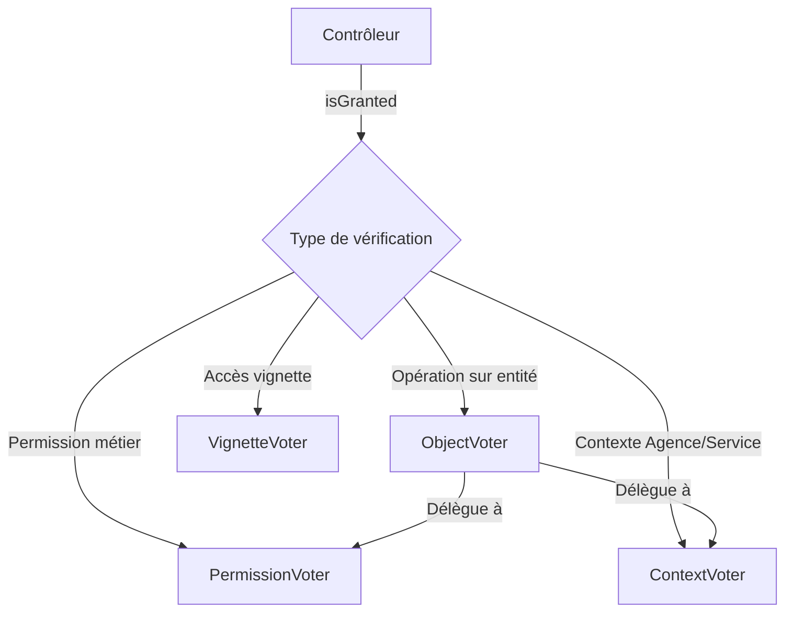

# Guide d'utilisation des Voters

## 📋 Vue d'ensemble

Votre application utilise **4 Voters** qui travaillent ensemble pour gérer les autorisations :



---

## 1️⃣ ContextVoter - Vérification Agence/Service

### 📍 Où est-il utilisé ?

Le `ContextVoter` est utilisé **indirectement** via l'`ObjectVoter` :

**Fichier** : [`ObjectVoter.php`](file:///d:/hff_symfony_5/src/Security/Voter/ObjectVoter.php#L66)
```php
// Ligne 66
if (!$this->authChecker->isGranted('CONTEXT_ACCESS', [$agence, $service])) {
    return false;
}
```

### 🎯 Cas d'usage

Le `ContextVoter` vérifie si un utilisateur a accès à une **entité spécifique** en fonction de son agence et service émetteur.

#### Exemple dans un contrôleur

```php
// Récupérer un DOM spécifique
$dom = $domRepository->find($id);

// Vérifier si l'utilisateur peut le voir
$this->denyAccessUnlessGranted('VIEW', $dom);
```

**Ce qui se passe en coulisses** :
1. `ObjectVoter` est appelé avec `'VIEW'` et l'entité `$dom`
2. `ObjectVoter` vérifie la permission métier (ex: `RH_ORDRE_MISSION_VIEW`)
3. `ObjectVoter` extrait l'agence et le service du DOM :
   ```php
   $agence = $dom->getAgenceEmetteurId();
   $service = $dom->getServiceEmetteurId();
   ```
4. `ObjectVoter` appelle `ContextVoter` :
   ```php
   $this->isGranted('CONTEXT_ACCESS', [$agence, $service])
   ```
5. `ContextVoter` vérifie si l'utilisateur a accès à cette agence/service

### 🔧 Logique du ContextVoter

**Fichier** : [`ContextVoter.php`](file:///d:/hff_symfony_5/src/Security/Voter/ContextVoter.php)

```php
// 1️⃣ Admin = accès total
if (in_array('ROLE_ADMIN', $user->getRoles(), true)) {
    return true;
}

// 2️⃣ Vérifier les UserAccess
foreach ($user->getUserAccesses() as $access) {
    if ($this->matchAccess($access, $agence, $service)) {
        return true;
    }
}
```

**Cas gérés** :
- ✅ `allAgence = true` et `allService = true` → Accès total
- ✅ `allAgence = true` et `service = X` → Toutes agences pour le service X
- ✅ `agence = Y` et `allService = true` → Tous services de l'agence Y
- ✅ `agence = Y` et `service = X` → Uniquement agence Y + service X

---

## 2️⃣ AgenceAccessService vs ContextVoter

### Quand utiliser quoi ?

| Situation | Outil à utiliser | Exemple |
|-----------|------------------|---------|
| **Lister** plusieurs DOMs | `AgenceAccessService` | Page de liste avec filtres |
| **Afficher/Modifier** un DOM spécifique | `ContextVoter` (via `ObjectVoter`) | Page de détail/édition |
| **Créer** un nouveau DOM | `PermissionVoter` uniquement | Formulaire de création |

### Exemple complet : Workflow DOM

#### 1. **Liste des DOMs** (utilise `AgenceAccessService`)

```php
// DomsListeController.php
public function index(AgenceAccessService $agenceAccessService)
{
    // Récupérer les agences autorisées
    $agenceIds = $agenceAccessService->getAuthorizedAgenceIds($this->getUser());
    
    // Filtrer la requête SQL
    $doms = $domRepository->findPaginatedAndFiltered($page, $limit, $dto, $agenceIds);
}
```

**Résultat** : L'utilisateur ne voit que les DOMs de ses agences autorisées.

#### 2. **Afficher un DOM** (utilise `ContextVoter`)

```php
// DomShowController.php
public function show($id, DomRepository $domRepository)
{
    $dom = $domRepository->find($id);
    
    // Vérifie automatiquement :
    // - Permission RH_ORDRE_MISSION_VIEW
    // - Accès à l'agence/service du DOM
    $this->denyAccessUnlessGranted('VIEW', $dom);
    
    return $this->render('dom/show.html.twig', ['dom' => $dom]);
}
```

**Résultat** : Même si l'utilisateur devine l'ID d'un DOM d'une autre agence, il sera bloqué.

#### 3. **Modifier un DOM** (utilise `ContextVoter`)

```php
// DomEditController.php
public function edit($id, DomRepository $domRepository)
{
    $dom = $domRepository->find($id);
    
    // Vérifie EDIT + contexte agence/service
    $this->denyAccessUnlessGranted('EDIT', $dom);
    
    // ...
}
```

---

## 3️⃣ Utilisation dans Twig

### Vérifier l'accès dans les templates

```twig
{# Afficher le bouton "Modifier" uniquement si autorisé #}

    <a href="{{ path('dom_edit', {id: dom.id}) }}" class="btn btn-primary">
        Modifier
    </a>


{# Afficher le bouton "Supprimer" uniquement si autorisé #}

    <a href="{{ path('dom_delete', {id: dom.id}) }}" class="btn btn-danger">
        Supprimer
    </a>

```

---

## 4️⃣ Configuration de l'ObjectVoter

### Activer pour l'entité Dom

**Fichier** : [`ObjectVoter.php`](file:///d:/hff_symfony_5/src/Security/Voter/ObjectVoter.php#L41-L45)

Actuellement, le mapping est vide. Pour activer le `ContextVoter` sur les DOMs, ajoutez :

```php
$map = [
    Dom::class => 'RH_ORDRE_MISSION_',
    // Autres entités...
];
```

**Avec cette configuration** :
- `isGranted('VIEW', $dom)` → Vérifie `RH_ORDRE_MISSION_VIEW` + contexte
- `isGranted('EDIT', $dom)` → Vérifie `RH_ORDRE_MISSION_EDIT` + contexte
- `isGranted('DELETE', $dom)` → Vérifie `RH_ORDRE_MISSION_DELETE` + contexte

---

## 5️⃣ Résumé : Qui fait quoi ?

| Voter | Responsabilité | Utilisé pour |
|-------|----------------|--------------|
| **PermissionVoter** | Vérifier les permissions métier | `isGranted('RH_ORDRE_MISSION_VIEW')` |
| **ContextVoter** | Vérifier l'accès agence/service | `isGranted('CONTEXT_ACCESS', [$agence, $service])` |
| **ObjectVoter** | Combiner permission + contexte | `isGranted('VIEW', $dom)` |
| **VignetteVoter** | Vérifier l'accès aux vignettes | `isGranted('VIGNETTE_ACCESS', $vignette)` |

| Service | Responsabilité | Utilisé pour |
|---------|----------------|--------------|
| **AgenceAccessService** | Récupérer les IDs d'agences autorisées | Filtrer les requêtes SQL |

---

## 🚀 Prochaines étapes recommandées

1. **Activer l'ObjectVoter pour Dom** en ajoutant le mapping
2. **Utiliser `isGranted('VIEW', $dom)`** dans vos contrôleurs de détail/édition
3. **Utiliser `AgenceAccessService`** dans vos contrôleurs de liste
4. **Ajouter les vérifications dans Twig** pour masquer les boutons non autorisés
