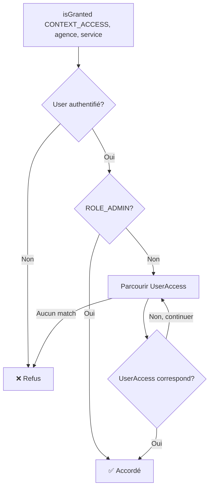

# ContextVoter - Documentation Détaillée

## Vue d'ensemble

Le `ContextVoter` est un voter Symfony qui vérifie si un utilisateur a le droit d'accéder à une ressource en fonction de son **contexte organisationnel**, c'est-à-dire son périmètre d'intervention défini par une **agence** et un **service**.

**Fichier source :** [ContextVoter.php](../../src/Security/Voter/ContextVoter.php)

## Rôle et responsabilité

Le `ContextVoter` permet de répondre à la question :

> "Est-ce que cet utilisateur a le droit d'intervenir sur une ressource liée à cette agence et ce service ?"

Il est utilisé pour :
- Vérifier qu'un utilisateur peut accéder aux données d'une agence/service spécifique
- Filtrer les données affichées selon le périmètre de l'utilisateur
- Combiner avec d'autres voters (comme `ObjectVoter`) pour une sécurité complète

## Attribut géré

Le voter ne gère qu'un seul attribut :

| Attribut | Valeur | Description |
|----------|--------|-------------|
| **CONTEXT_ACCESS** | `'CONTEXT_ACCESS'` | Vérifie l'accès au contexte agence/service |

## Format du sujet

Le sujet doit être un **tableau de 2 éléments** :

```php
[$agence, $service]
```

Où :
- `$agence` : Instance de `App\Entity\Admin\AgenceService\Agence` ou `null`
- `$service` : Instance de `App\Entity\Admin\AgenceService\Service` ou `null`

## Utilisation

### Dans un contrôleur

#### Vérification simple

```php
use App\Entity\Admin\AgenceService\Agence;
use App\Entity\Admin\AgenceService\Service;
use Symfony\Bundle\FrameworkBundle\Controller\AbstractController;

class DemandeController extends AbstractController
{
    public function index(Agence $agence, Service $service)
    {
        // Vérifie que l'utilisateur a accès à ce périmètre
        $this->denyAccessUnlessGranted('CONTEXT_ACCESS', [$agence, $service]);
        
        // L'utilisateur a accès, continuer...
        $demandes = $this->demandeRepository->findByAgenceAndService($agence, $service);
        
        return $this->render('demande/index.html.twig', [
            'demandes' => $demandes,
            'agence' => $agence,
            'service' => $service
        ]);
    }
}
```

#### Vérification depuis une entité

```php
public function edit(DemandeConge $demande)
{
    // Récupérer le contexte depuis l'entité
    $agence = $demande->getAgence();
    $service = $demande->getService();
    
    // Vérifier l'accès au contexte
    $this->denyAccessUnlessGranted('CONTEXT_ACCESS', [$agence, $service]);
    
    // Traiter l'édition...
}
```

#### Vérification conditionnelle

```php
public function dashboard()
{
    $agences = $this->agenceRepository->findAll();
    $accessibleAgences = [];
    
    foreach ($agences as $agence) {
        // Vérifier pour chaque agence (tous services)
        if ($this->isGranted('CONTEXT_ACCESS', [$agence, null])) {
            $accessibleAgences[] = $agence;
        }
    }
    
    return $this->render('dashboard.html.twig', [
        'agences' => $accessibleAgences
    ]);
}
```

### Dans un template Twig

```twig
{# Affichage conditionnel selon le contexte #}

    
        <div class="demande-item">
            <h3>{{ demande.titre }}</h3>
            <p>Agence : {{ demande.agence.nom }}</p>
            <p>Service : {{ demande.service.nom }}</p>
        </div>
    

```

```twig
{# Filtrage de navigation #}
<ul class="agence-list">
    
        
            <li>
                <a href="{{ path('agence_view', {id: agence.id}) }}">
                    {{ agence.nom }}
                </a>
            </li>
        
    
</ul>
```

### Dans un autre voter (ObjectVoter)

Le `ContextVoter` est souvent appelé par d'autres voters pour combiner les vérifications :

```php
// Dans ObjectVoter.php
protected function voteOnAttribute(string $attribute, $subject, TokenInterface $token): bool
{
    // ... vérification de permission métier ...
    
    // Vérification du contexte si l'objet a une agence/service
    $agence = method_exists($subject, 'getAgence') ? $subject->getAgence() : null;
    $service = method_exists($subject, 'getService') ? $subject->getService() : null;
    
    if ($agence || $service) {
        // Déléguer la vérification de contexte au ContextVoter
        if (!$this->authChecker->isGranted('CONTEXT_ACCESS', [$agence, $service])) {
            return false;
        }
    }
    
    return true;
}
```

### Dans un service métier

```php
use Symfony\Component\Security\Core\Authorization\AuthorizationCheckerInterface;

class DemandeService
{
    public function __construct(
        private AuthorizationCheckerInterface $authChecker
    ) {}
    
    public function canAccessDemande(DemandeConge $demande): bool
    {
        return $this->authChecker->isGranted('CONTEXT_ACCESS', [
            $demande->getAgence(),
            $demande->getService()
        ]);
    }
    
    public function getAccessibleDemandes(array $demandes): array
    {
        return array_filter($demandes, function($demande) {
            return $this->canAccessDemande($demande);
        });
    }
}
```

## Logique de vérification

### Diagramme de flux



### Cas de correspondance

Le voter parcourt tous les `UserAccess` de l'utilisateur et vérifie 4 cas possibles :

| # | `allAgence` | `allService` | `agence` | `service` | Condition d'accès | Exemple d'usage |
|---|-------------|--------------|----------|----------|-------------------|-----------------|
| **1️⃣** | ✅ | ✅ | - | - | Toujours accordé | Super-utilisateur métier |
| **2️⃣** | ✅ | ❌ | - | ✅ | `access.service.id == service.id` | Responsable d'un service dans toutes les agences |
| **3️⃣** | ❌ | ✅ | ✅ | - | `access.agence.id == agence.id` | Directeur d'agence (tous services) |
| **4️⃣** | ❌ | ❌ | ✅ | ✅ | `access.agence.id == agence.id` ET `access.service.id == service.id` | Chef de service dans une agence |

### Code de vérification

Voici la logique simplifiée de la méthode `matchAccess` :

```php
private function matchAccess(UserAccess $access, ?Agence $agence, ?Service $service): bool
{
    // Cas 1️⃣ : Accès total (toutes agences, tous services)
    if ($access->getAllAgence() && $access->getAllService()) {
        return true;
    }
    
    // Cas 2️⃣ : Toutes agences pour un service précis
    if ($access->getAllAgence() && $access->getService()) {
        return $service && $access->getService()->getId() === $service->getId();
    }
    
    // Cas 3️⃣ : Tous services pour une agence précise
    if ($access->getAllService() && $access->getAgence()) {
        return $agence && $access->getAgence()->getId() === $agence->getId();
    }
    
    // Cas 4️⃣ : Agence ET service spécifiques
    if ($access->getAgence() && $access->getService()) {
        return (
            $agence && $access->getAgence()->getId() === $agence->getId() &&
            $service && $access->getService()->getId() === $service->getId()
        );
    }
    
    return false;
}
```

## Exemples de configuration UserAccess

### Exemple 1 : Accès total

```php
$userAccess = new UserAccess();
$userAccess->setAllAgence(true);
$userAccess->setAllService(true);
// Cet utilisateur a accès à TOUS les contextes
```

### Exemple 2 : Responsable RH national

```php
$serviceRH = $serviceRepository->findOneBy(['code' => 'RH']);

$userAccess = new UserAccess();
$userAccess->setAllAgence(true);  // Toutes les agences
$userAccess->setService($serviceRH);  // Mais uniquement le service RH
// Accès au service RH de toutes les agences
```

### Exemple 3 : Directeur d'agence

```php
$agenceParis = $agenceRepository->findOneBy(['code' => 'PARIS']);

$userAccess = new UserAccess();
$userAccess->setAgence($agenceParis);  // Agence de Paris
$userAccess->setAllService(true);  // Tous les services
// Accès à tous les services de l'agence de Paris
```

### Exemple 4 : Chef de service local

```php
$agenceLyon = $agenceRepository->findOneBy(['code' => 'LYON']);
$serviceCompta = $serviceRepository->findOneBy(['code' => 'COMPTA']);

$userAccess = new UserAccess();
$userAccess->setAgence($agenceLyon);
$userAccess->setService($serviceCompta);
// Accès uniquement au service Compta de l'agence de Lyon
```

## Cas particuliers

### Valeurs null

Le voter accepte `null` pour l'agence ou le service :

```php
// Vérifier l'accès à une agence (tous services)
$this->isGranted('CONTEXT_ACCESS', [$agence, null]);

// Vérifier l'accès à un service (toutes agences)
$this->isGranted('CONTEXT_ACCESS', [null, $service]);

// Les deux null : toujours refusé (sauf ROLE_ADMIN)
$this->isGranted('CONTEXT_ACCESS', [null, null]);
```

### Rôle ROLE_ADMIN

> [!IMPORTANT]
> Les utilisateurs avec le rôle `ROLE_ADMIN` ont **automatiquement accès à tous les contextes**, quel que soit leur configuration de `UserAccess`.

```php
// Dans voteOnAttribute()
if (in_array('ROLE_ADMIN', $user->getRoles(), true)) {
    return true;  // Accès total
}
```

## Bonnes pratiques

### ✅ À faire

```php
// Vérifier le contexte avant d'afficher des données sensibles
public function showSalaires(Agence $agence, Service $service)
{
    $this->denyAccessUnlessGranted('CONTEXT_ACCESS', [$agence, $service]);
    // ...
}

// Filtrer les résultats selon le contexte
public function listDemandes()
{
    $demandes = $this->demandeRepository->findAll();
    return array_filter($demandes, function($d) {
        return $this->isGranted('CONTEXT_ACCESS', [$d->getAgence(), $d->getService()]);
    });
}

// Combiner avec ObjectVoter pour une sécurité complète
$this->denyAccessUnlessGranted('EDIT', $demande);
// ObjectVoter vérifie automatiquement le contexte via ContextVoter
```

### ❌ À éviter

```php
// ❌ Ne pas passer un tableau vide
$this->isGranted('CONTEXT_ACCESS', []);  // Erreur !

// ❌ Ne pas passer plus de 2 éléments
$this->isGranted('CONTEXT_ACCESS', [$agence, $service, $autre]);  // Erreur !

// ❌ Ne pas passer des objets d'un mauvais type
$this->isGranted('CONTEXT_ACCESS', [$user, $permission]);  // Ne fonctionnera pas

// ❌ Ne pas oublier de vérifier le contexte pour les données sensibles
public function showSalaires(Agence $agence)
{
    // Manque la vérification !
    return $this->render('salaires.html.twig', [
        'salaires' => $this->salaireRepository->findByAgence($agence)
    ]);
}
```

## Tests unitaires

### Exemple de test

```php
use App\Security\Voter\ContextVoter;
use App\Entity\Admin\PersonnelUser\User;
use App\Entity\Admin\PersonnelUser\UserAccess;
use App\Entity\Admin\AgenceService\Agence;
use App\Entity\Admin\AgenceService\Service;
use PHPUnit\Framework\TestCase;
use Symfony\Component\Security\Core\Authentication\Token\TokenInterface;

class ContextVoterTest extends TestCase
{
    private ContextVoter $voter;
    
    protected function setUp(): void
    {
        $this->voter = new ContextVoter();
    }
    
    public function testAdminHasAccessToAllContexts()
    {
        $user = $this->createUser(['ROLE_ADMIN']);
        $token = $this->createToken($user);
        $agence = $this->createAgence();
        $service = $this->createService();
        
        $result = $this->voter->vote($token, [$agence, $service], ['CONTEXT_ACCESS']);
        
        $this->assertEquals(VoterInterface::ACCESS_GRANTED, $result);
    }
    
    public function testUserWithAllAccessHasAccessToAnyContext()
    {
        $user = $this->createUser();
        $access = new UserAccess();
        $access->setAllAgence(true);
        $access->setAllService(true);
        $user->addUserAccess($access);
        
        $token = $this->createToken($user);
        $agence = $this->createAgence();
        $service = $this->createService();
        
        $result = $this->voter->vote($token, [$agence, $service], ['CONTEXT_ACCESS']);
        
        $this->assertEquals(VoterInterface::ACCESS_GRANTED, $result);
    }
    
    public function testUserWithSpecificAgenceServiceAccess()
    {
        $agenceParis = $this->createAgence('Paris');
        $serviceRH = $this->createService('RH');
        
        $user = $this->createUser();
        $access = new UserAccess();
        $access->setAgence($agenceParis);
        $access->setService($serviceRH);
        $user->addUserAccess($access);
        
        $token = $this->createToken($user);
        
        // Devrait avoir accès
        $result = $this->voter->vote($token, [$agenceParis, $serviceRH], ['CONTEXT_ACCESS']);
        $this->assertEquals(VoterInterface::ACCESS_GRANTED, $result);
        
        // Ne devrait PAS avoir accès à une autre agence
        $agenceLyon = $this->createAgence('Lyon');
        $result = $this->voter->vote($token, [$agenceLyon, $serviceRH], ['CONTEXT_ACCESS']);
        $this->assertEquals(VoterInterface::ACCESS_DENIED, $result);
    }
}
```

## Débogage

### Afficher les accès d'un utilisateur

```php
// Dans un contrôleur
public function debugAccess()
{
    $user = $this->getUser();
    
    dump('Rôles:', $user->getRoles());
    
    foreach ($user->getUserAccesses() as $access) {
        dump([
            'allAgence' => $access->getAllAgence(),
            'allService' => $access->getAllService(),
            'agence' => $access->getAgence()?->getNom(),
            'service' => $access->getService()?->getNom(),
            'permissions' => array_map(
                fn($p) => $p->getCode(),
                $access->getPermissions()->toArray()
            )
        ]);
    }
}
```

### Tester un contexte spécifique

```php
// Tester rapidement un contexte
$agence = $this->agenceRepository->find(1);
$service = $this->serviceRepository->find(2);

if ($this->isGranted('CONTEXT_ACCESS', [$agence, $service])) {
    dump('✅ Accès accordé');
} else {
    dump('❌ Accès refusé');
$userAccess->setService($serviceCompta);
// Accès uniquement au service Compta de l'agence de Lyon
```

## Cas particuliers

### Valeurs null

Le voter accepte `null` pour l'agence ou le service :

```php
// Vérifier l'accès à une agence (tous services)
$this->isGranted('CONTEXT_ACCESS', [$agence, null]);

// Vérifier l'accès à un service (toutes agences)
$this->isGranted('CONTEXT_ACCESS', [null, $service]);

// Les deux null : toujours refusé (sauf ROLE_ADMIN)
$this->isGranted('CONTEXT_ACCESS', [null, null]);
```

### Rôle ROLE_ADMIN

> [!IMPORTANT]
> Les utilisateurs avec le rôle `ROLE_ADMIN` ont **automatiquement accès à tous les contextes**, quel que soit leur configuration de `UserAccess`.

```php
// Dans voteOnAttribute()
if (in_array('ROLE_ADMIN', $user->getRoles(), true)) {
    return true;  // Accès total
}
```

## Bonnes pratiques

### ✅ À faire

```php
// Vérifier le contexte avant d'afficher des données sensibles
public function showSalaires(Agence $agence, Service $service)
{
    $this->denyAccessUnlessGranted('CONTEXT_ACCESS', [$agence, $service]);
    // ...
}

// Filtrer les résultats selon le contexte
public function listDemandes()
{
    $demandes = $this->demandeRepository->findAll();
    return array_filter($demandes, function($d) {
        return $this->isGranted('CONTEXT_ACCESS', [$d->getAgence(), $d->getService()]);
    });
}

// Combiner avec ObjectVoter pour une sécurité complète
$this->denyAccessUnlessGranted('EDIT', $demande);
// ObjectVoter vérifie automatiquement le contexte via ContextVoter
```

### ❌ À éviter

```php
// ❌ Ne pas passer un tableau vide
$this->isGranted('CONTEXT_ACCESS', []);  // Erreur !

// ❌ Ne pas passer plus de 2 éléments
$this->isGranted('CONTEXT_ACCESS', [$agence, $service, $autre]);  // Erreur !

// ❌ Ne pas passer des objets d'un mauvais type
$this->isGranted('CONTEXT_ACCESS', [$user, $permission]);  // Ne fonctionnera pas

// ❌ Ne pas oublier de vérifier le contexte pour les données sensibles
public function showSalaires(Agence $agence)
{
    // Manque la vérification !
    return $this->render('salaires.html.twig', [
        'salaires' => $this->salaireRepository->findByAgence($agence)
    ]);
}
```

## Tests unitaires

### Exemple de test

```php
use App\Security\Voter\ContextVoter;
use App\Entity\Admin\PersonnelUser\User;
use App\Entity\Admin\PersonnelUser\UserAccess;
use App\Entity\Admin\AgenceService\Agence;
use App\Entity\Admin\AgenceService\Service;
use PHPUnit\Framework\TestCase;
use Symfony\Component\Security\Core\Authentication\Token\TokenInterface;

class ContextVoterTest extends TestCase
{
    private ContextVoter $voter;
    
    protected function setUp(): void
    {
        $this->voter = new ContextVoter();
    }
    
    public function testAdminHasAccessToAllContexts()
    {
        $user = $this->createUser(['ROLE_ADMIN']);
        $token = $this->createToken($user);
        $agence = $this->createAgence();
        $service = $this->createService();
        
        $result = $this->voter->vote($token, [$agence, $service], ['CONTEXT_ACCESS']);
        
        $this->assertEquals(VoterInterface::ACCESS_GRANTED, $result);
    }
    
    public function testUserWithAllAccessHasAccessToAnyContext()
    {
        $user = $this->createUser();
        $access = new UserAccess();
        $access->setAllAgence(true);
        $access->setAllService(true);
        $user->addUserAccess($access);
        
        $token = $this->createToken($user);
        $agence = $this->createAgence();
        $service = $this->createService();
        
        $result = $this->voter->vote($token, [$agence, $service], ['CONTEXT_ACCESS']);
        
        $this->assertEquals(VoterInterface::ACCESS_GRANTED, $result);
    }
    
    public function testUserWithSpecificAgenceServiceAccess()
    {
        $agenceParis = $this->createAgence('Paris');
        $serviceRH = $this->createService('RH');
        
        $user = $this->createUser();
        $access = new UserAccess();
        $access->setAgence($agenceParis);
        $access->setService($serviceRH);
        $user->addUserAccess($access);
        
        $token = $this->createToken($user);
        
        // Devrait avoir accès
        $result = $this->voter->vote($token, [$agenceParis, $serviceRH], ['CONTEXT_ACCESS']);
        $this->assertEquals(VoterInterface::ACCESS_GRANTED, $result);
        
        // Ne devrait PAS avoir accès à une autre agence
        $agenceLyon = $this->createAgence('Lyon');
        $result = $this->voter->vote($token, [$agenceLyon, $serviceRH], ['CONTEXT_ACCESS']);
        $this->assertEquals(VoterInterface::ACCESS_DENIED, $result);
    }
}
```

## Débogage

### Afficher les accès d'un utilisateur

```php
// Dans un contrôleur
public function debugAccess()
{
    $user = $this->getUser();
    
    dump('Rôles:', $user->getRoles());
    
    foreach ($user->getUserAccesses() as $access) {
        dump([
            'allAgence' => $access->getAllAgence(),
            'allService' => $access->getAllService(),
            'agence' => $access->getAgence()?->getNom(),
            'service' => $access->getService()?->getNom(),
            'permissions' => array_map(
                fn($p) => $p->getCode(),
                $access->getPermissions()->toArray()
            )
        ]);
    }
}
```

### Tester un contexte spécifique

```php
// Tester rapidement un contexte
$agence = $this->agenceRepository->find(1);
$service = $this->serviceRepository->find(2);

if ($this->isGranted('CONTEXT_ACCESS', [$agence, $service])) {
    dump('✅ Accès accordé');
} else {
    dump('❌ Accès refusé');
}
```

## Ressources

- [Voters.md - Documentation générale](Voters.md)
- [ObjectVoter - Utilisation combinée](Voters.md#objectvoter)
- [Documentation Symfony sur les Voters](https://symfony.com/doc/current/security/voters.html)