# VignetteVoter - Documentation Détaillée

## Vue d'ensemble

Le `VignetteVoter` est un voter Symfony qui détermine si un utilisateur a le droit de **voir et d'accéder à une application** (module fonctionnel) de l'interface. Chaque application est représentée par une "vignette" affichée sur la page d'accueil ou dans le menu de navigation.

**Fichier source :** [VignetteVoter.php](../../src/Security/Voter/VignetteVoter.php)

## Rôle et responsabilité

Le `VignetteVoter` permet de répondre à la question :

> "Est-ce que cet utilisateur a le droit d'accéder à cette application/module ?"

Il est utilisé pour :
- Afficher dynamiquement les vignettes d'applications selon les droits de l'utilisateur
- Masquer les modules auxquels l'utilisateur n'a pas accès
- Créer une interface personnalisée en fonction du profil utilisateur
- Contrôler l'accès aux différentes sections de l'application

## Attribut géré

Le voter ne gère qu'un seul attribut :

| Attribut | Valeur | Description |
|----------|--------|-------------|
| **APPLICATION_ACCESS** | `'APPLICATION_ACCESS'` | Vérifie l'accès à une application/vignette |

## Format du sujet

Le sujet doit être une instance de `App\Entity\Admin\ApplicationGroupe\Vignette`.

```php
$vignette = $vignetteRepository->findOneBy(['nom' => 'RH']);
$this->isGranted('APPLICATION_ACCESS', $vignette);
```

## Logique de correspondance

Le voter utilise une **correspondance par préfixe** entre le nom de la vignette et les permissions de l'utilisateur.

### Principe

Pour qu'un utilisateur ait accès à une vignette, il doit posséder **au moins une permission** dont le code commence par le nom de la vignette suivi d'un underscore.

**Format :** `{NOM_VIGNETTE}_{ACTION}`

### Exemples de correspondance

| Vignette | Nom | Permissions donnant accès | Exemples |
|----------|-----|---------------------------|----------|
| 🧑‍💼 **RH** | `RH` | `RH_*` | `RH_CONGE_VIEW`, `RH_CONGE_CREATE`, `RH_SALAIRE_READ`, `RH_PERSONNEL_EDIT` |
| 📦 **APPRO** | `APPRO` | `APPRO_*` | `APPRO_BC_VIEW`, `APPRO_BC_CREATE`, `APPRO_BC_VALIDATE` |
| ⚙️ **ADMIN** | `ADMIN` | `ADMIN_*` | `ADMIN_USER_EDIT`, `ADMIN_PERMISSION_MANAGE`, `ADMIN_CONFIG_UPDATE` |
| 💰 **COMPTA** | `COMPTA` | `COMPTA_*` | `COMPTA_FACTURE_VIEW`, `COMPTA_PAIEMENT_CREATE` |

### Diagramme de correspondance

```mermaid
graph LR
    A[Vignette 'RH'] --> B{User a permission<br/>commençant par 'RH_'?}
    B -->|RH_CONGE_VIEW| C[✅ Accès accordé]
    B -->|RH_SALAIRE_READ| C
    B -->|RH_PERSONNEL_EDIT| C
    B -->|Aucune| D[❌ Accès refusé]
    
    E[Vignette 'APPRO'] --> F{User a permission<br/>commençant par 'APPRO_'?}
    F -->|APPRO_BC_VIEW| G[✅ Accès accordé]
    F -->|APPRO_BC_VALIDATE| G
    F -->|Aucune| H[❌ Accès refusé]
```



## Utilisation

### Dans un template Twig - Affichage des vignettes

#### Exemple simple

```twig
{# Page d'accueil avec vignettes #}
<div class="vignettes-container">
    
        
            <div class="vignette">
                <a href="{{ vignette.url }}">
                    <i class="{{ vignette.icon }}"></i>
                    <h3>{{ vignette.nom }}</h3>
                    <p>{{ vignette.description }}</p>
                </a>
            </div>
        
    
</div>
```

#### Exemple avec compteur

```twig


<div class="dashboard">
    
        
            
            <div class="vignette-card">
                <a href="{{ vignette.url }}" class="vignette-link">
                    <div class="vignette-icon">
                        <i class="{{ vignette.icon }}"></i>
                    </div>
                    <div class="vignette-content">
                        <h4>{{ vignette.nom }}</h4>
                        <p>{{ vignette.description }}</p>
                    </div>
                </a>
            </div>
        
    
</div>


    <div class="alert alert-warning">
        Vous n'avez accès à aucune application. Contactez votre administrateur.
    </div>

```

#### Exemple avec groupes

```twig
{# Vignettes organisées par groupe #}

    <div class="vignette-groupe">
        <h2>{{ groupe.nom }}</h2>
        <div class="vignettes-grid">
            
                
                    <div class="vignette-item">
                        <a href="{{ path(vignette.route) }}">
                            <span class="icon">{{ vignette.icon }}</span>
                            <span class="label">{{ vignette.nom }}</span>
                        </a>
                    </div>
                
            
        </div>
    </div>

```

### Dans un contrôleur

#### Vérification d'accès

```php
use App\Entity\Admin\ApplicationGroupe\Vignette;
use Symfony\Bundle\FrameworkBundle\Controller\AbstractController;

class ApplicationController extends AbstractController
{
    public function accessApplication(Vignette $vignette)
    {
        // Vérifier que l'utilisateur a accès à cette application
        $this->denyAccessUnlessGranted('APPLICATION_ACCESS', $vignette);
        
        // Rediriger vers l'application
        return $this->redirect($vignette->getUrl());
    }
}
```

#### Filtrage des vignettes accessibles

```php
public function dashboard(VignetteRepository $vignetteRepository)
{
    $allVignettes = $vignetteRepository->findAll();
    
    // Filtrer les vignettes accessibles
    $accessibleVignettes = array_filter($allVignettes, function($vignette) {
        return $this->isGranted('APPLICATION_ACCESS', $vignette);
    });
    
    return $this->render('dashboard/index.html.twig', [
        'vignettes' => $accessibleVignettes
    ]);
}
```

#### Vérification conditionnelle

```php
public function showMenu(VignetteRepository $vignetteRepository)
{
    $vignettes = $vignetteRepository->findAll();
    $menuItems = [];
    
    foreach ($vignettes as $vignette) {
        if ($this->isGranted('APPLICATION_ACCESS', $vignette)) {
            $menuItems[] = [
                'label' => $vignette->getNom(),
                'url' => $vignette->getUrl(),
                'icon' => $vignette->getIcon()
            ];
        }
    }
    
    return $this->json($menuItems);
}
```

### Dans un service

```php
use Symfony\Component\Security\Core\Authorization\AuthorizationCheckerInterface;

class VignetteService
{
    public function __construct(
        private AuthorizationCheckerInterface $authChecker,
        private VignetteRepository $vignetteRepository
    ) {}
    
    public function getAccessibleVignettes(User $user): array
    {
        $allVignettes = $this->vignetteRepository->findAll();
        
        return array_filter($allVignettes, function($vignette) {
            return $this->authChecker->isGranted('APPLICATION_ACCESS', $vignette);
        });
    }
    
    public function canAccessApplication(string $applicationName): bool
    {
        $vignette = $this->vignetteRepository->findOneBy(['nom' => $applicationName]);
        
        if (!$vignette) {
            return false;
        }
        
        return $this->authChecker->isGranted('APPLICATION_ACCESS', $vignette);
    }
}
```

## Logique de vérification

### Diagramme de flux

```mermaid
graph TD
    A[isGranted APPLICATION_ACCESS, vignette] --> B{User authentifié?}
    B -->|Non| Z[❌ Refus]
    B -->|Oui| C{ROLE_ADMIN?}
    C -->|Oui| Y[✅ Accordé]
    C -->|Non| D[Récupérer nom vignette]
    D --> E[Construire préfixe:<br/>NOM_VIGNETTE_]
    E --> F{Parcourir UserAccess}
    F --> G{Permission commence<br/>par préfixe?}
    G -->|Oui| Y
    G -->|Non, continuer| F
    F --> H{Parcourir permissions<br/>directes}
    H --> I{Permission commence<br/>par préfixe?}
    I -->|Oui| Y
    I -->|Non, continuer| H
    H -->|Aucun match| Z
```



### Code de vérification simplifié

```php
private function canAccessVignette(User $user, Vignette $vignette): bool
{
    $vignettePrefix = strtoupper($vignette->getNom() . '_');
    
    // 1️⃣ Vérifier dans les UserAccess
    foreach ($user->getUserAccesses() as $access) {
        foreach ($access->getPermissions() as $permission) {
            if (str_starts_with($permission->getCode(), $vignettePrefix)) {
                return true;
            }
        }
    }
    
    // 2️⃣ Vérifier dans les permissions directes
    foreach ($user->getPermissionsDirectes() as $permission) {
        if (str_starts_with($permission->getCode(), $vignettePrefix)) {
            return true;
        }
    }
    
    return false;
}
```

## Exemples de configuration

### Exemple 1 : Utilisateur RH

```php
// Permissions de l'utilisateur
$permissions = [
    'RH_CONGE_VIEW',
    'RH_CONGE_CREATE',
    'RH_PERSONNEL_VIEW'
];

// Vignettes accessibles
// ✅ Vignette 'RH' : OUI (a des permissions RH_*)
// ❌ Vignette 'APPRO' : NON (aucune permission APPRO_*)
// ❌ Vignette 'COMPTA' : NON (aucune permission COMPTA_*)
```

### Exemple 2 : Utilisateur multi-modules

```php
// Permissions de l'utilisateur
$permissions = [
    'RH_CONGE_VIEW',
    'APPRO_BC_VIEW',
    'APPRO_BC_CREATE'
];

// Vignettes accessibles
// ✅ Vignette 'RH' : OUI (a RH_CONGE_VIEW)
// ✅ Vignette 'APPRO' : OUI (a APPRO_BC_VIEW et APPRO_BC_CREATE)
// ❌ Vignette 'COMPTA' : NON
```

### Exemple 3 : Administrateur

```php
// Rôles de l'utilisateur
$roles = ['ROLE_ADMIN'];

// Vignettes accessibles
// ✅ TOUTES les vignettes (ROLE_ADMIN donne accès total)
```

## Cas particuliers

### Rôle ROLE_ADMIN

> [!IMPORTANT]
> Les utilisateurs avec le rôle `ROLE_ADMIN` ont **automatiquement accès à toutes les vignettes**, quelles que soient leurs permissions.

```php
if (in_array('ROLE_ADMIN', $user->getRoles(), true)) {
    return true;  // Accès à toutes les vignettes
}
```

### Vignettes sans correspondance de permissions

Si une vignette a un nom qui ne correspond à aucun préfixe de permission dans le système, seuls les `ROLE_ADMIN` y auront accès.

```php
// Vignette avec nom 'STATS'
// Si aucune permission ne commence par 'STATS_', seuls les admins y accèdent
```

### Sensibilité à la casse

> [!WARNING]
> Le nom de la vignette est converti en **MAJUSCULES** avant la comparaison.

```php
// Vignette avec nom 'rh' ou 'Rh' ou 'RH'
// Toutes cherchent des permissions commençant par 'RH_'
$vignettePrefix = strtoupper($vignette->getNom() . '_');  // Toujours 'RH_'
```

## Bonnes pratiques

### ✅ À faire

```php
// Toujours vérifier l'accès avant d'afficher une vignette

    {# Afficher la vignette #}


// Nommer les vignettes de manière cohérente avec les permissions
// Vignette 'RH' → Permissions 'RH_*'
// Vignette 'APPRO' → Permissions 'APPRO_*'

// Donner au moins une permission du module pour donner accès
$user->addPermission('RH_CONGE_VIEW');  // Donne accès à la vignette RH

// Grouper les vignettes par domaine fonctionnel
$groupe->addVignette($vignetteRH);
$groupe->addVignette($vignetteAppro);
```

### ❌ À éviter

```php
// ❌ Ne pas afficher des vignettes sans vérification
<a href="/rh">RH</a>  // L'utilisateur pourrait ne pas avoir accès

// ❌ Ne pas utiliser des noms de vignettes incohérents
// Vignette 'Ressources Humaines' mais permissions 'RH_*'
// Préférer 'RH' pour la cohérence

// ❌ Ne pas oublier de donner des permissions pour l'accès
// Si un utilisateur doit accéder à RH, il faut au moins une permission RH_*

// ❌ Ne pas créer de vignettes orphelines
// Toute vignette doit avoir des permissions associées dans le système
```

## Tests unitaires

### Exemple de test

```php
use App\Security\Voter\VignetteVoter;
use App\Entity\Admin\PersonnelUser\User;
use App\Entity\Admin\ApplicationGroupe\Vignette;
use App\Entity\Admin\ApplicationGroupe\Permission;
use PHPUnit\Framework\TestCase;

class VignetteVoterTest extends TestCase
{
    private VignetteVoter $voter;
    
    protected function setUp(): void
    {
        $this->voter = new VignetteVoter();
    }
    
    public function testAdminHasAccessToAllVignettes()
    {
        $user = $this->createUser(['ROLE_ADMIN']);
        $vignette = $this->createVignette('RH');
        $token = $this->createToken($user);
        
        $result = $this->voter->vote($token, $vignette, ['APPLICATION_ACCESS']);
        
        $this->assertEquals(VoterInterface::ACCESS_GRANTED, $result);
    }
    
    public function testUserWithMatchingPermissionHasAccess()
    {
        $user = $this->createUser();
        $permission = new Permission();
        $permission->setCode('RH_CONGE_VIEW');
        $user->addPermissionDirecte($permission);
        
        $vignette = $this->createVignette('RH');
        $token = $this->createToken($user);
        
        $result = $this->voter->vote($token, $vignette, ['APPLICATION_ACCESS']);
        
        $this->assertEquals(VoterInterface::ACCESS_GRANTED, $result);
    }
    
    public function testUserWithoutMatchingPermissionHasNoAccess()
    {
        $user = $this->createUser();
        $permission = new Permission();
        $permission->setCode('APPRO_BC_VIEW');  // Permission APPRO
        $user->addPermissionDirecte($permission);
        
        $vignette = $this->createVignette('RH');  // Vignette RH
        $token = $this->createToken($user);
        
        $result = $this->voter->vote($token, $vignette, ['APPLICATION_ACCESS']);
        
        $this->assertEquals(VoterInterface::ACCESS_DENIED, $result);
    }
    
    public function testUserWithPermissionViaUserAccessHasAccess()
    {
        $user = $this->createUser();
        
        $access = new UserAccess();
        $permission = new Permission();
        $permission->setCode('RH_SALAIRE_READ');
        $access->addPermission($permission);
        $user->addUserAccess($access);
        
        $vignette = $this->createVignette('RH');
        $token = $this->createToken($user);
        
        $result = $this->voter->vote($token, $vignette, ['APPLICATION_ACCESS']);
        
        $this->assertEquals(VoterInterface::ACCESS_GRANTED, $result);
    }
}
```

## Débogage

### Afficher les vignettes accessibles pour un utilisateur

```php
// Dans un contrôleur
public function debugVignettes(VignetteRepository $vignetteRepository)
{
    $user = $this->getUser();
    $vignettes = $vignetteRepository->findAll();
    
    $debug = [];
    foreach ($vignettes as $vignette) {
        $hasAccess = $this->isGranted('APPLICATION_ACCESS', $vignette);
        $debug[] = [
            'vignette' => $vignette->getNom(),
            'access' => $hasAccess ? '✅' : '❌'
        ];
    }
    
    dump($debug);
}
```

### Afficher les permissions donnant accès à une vignette

```php
public function debugPermissionsForVignette(string $vignetteName)
{
    $user = $this->getUser();
    $prefix = strtoupper($vignetteName . '_');
    
    $matchingPermissions = [];
    
    // Permissions directes
    foreach ($user->getPermissionsDirectes() as $permission) {
        if (str_starts_with($permission->getCode(), $prefix)) {
            $matchingPermissions[] = [
                'code' => $permission->getCode(),
                'source' => 'direct'
            ];
        }
    }
    
    // Permissions via UserAccess
    foreach ($user->getUserAccesses() as $access) {
        foreach ($access->getPermissions() as $permission) {
            if (str_starts_with($permission->getCode(), $prefix)) {
                $matchingPermissions[] = [
                    'code' => $permission->getCode(),
                    'source' => 'UserAccess'
                ];
            }
        }
    }
    
    dump("Permissions pour vignette '$vignetteName':", $matchingPermissions);
}
```

## Tableau récapitulatif des vignettes courantes

| Vignette | Préfixe | Permissions typiques | Description |
|----------|---------|----------------------|-------------|
| **RH** | `RH_` | `RH_CONGE_*`, `RH_PERSONNEL_*`, `RH_SALAIRE_*` | Gestion des ressources humaines |
| **APPRO** | `APPRO_` | `APPRO_BC_*`, `APPRO_FOURNISSEUR_*` | Gestion des approvisionnements |
| **COMPTA** | `COMPTA_` | `COMPTA_FACTURE_*`, `COMPTA_PAIEMENT_*` | Gestion comptable |
> Le nom de la vignette est converti en **MAJUSCULES** avant la comparaison.

```php
// Vignette avec nom 'rh' ou 'Rh' ou 'RH'
// Toutes cherchent des permissions commençant par 'RH_'
$vignettePrefix = strtoupper($vignette->getNom() . '_');  // Toujours 'RH_'
```

## Bonnes pratiques

### ✅ À faire

```php
// Toujours vérifier l'accès avant d'afficher une vignette

    {# Afficher la vignette #}


// Nommer les vignettes de manière cohérente avec les permissions
// Vignette 'RH' → Permissions 'RH_*'
// Vignette 'APPRO' → Permissions 'APPRO_*'

// Donner au moins une permission du module pour donner accès
$user->addPermission('RH_CONGE_VIEW');  // Donne accès à la vignette RH

// Grouper les vignettes par domaine fonctionnel
$groupe->addVignette($vignetteRH);
$groupe->addVignette($vignetteAppro);
```

### ❌ À éviter

```php
// ❌ Ne pas afficher des vignettes sans vérification
<a href="/rh">RH</a>  // L'utilisateur pourrait ne pas avoir accès

// ❌ Ne pas utiliser des noms de vignettes incohérents
// Vignette 'Ressources Humaines' mais permissions 'RH_*'
// Préférer 'RH' pour la cohérence

// ❌ Ne pas oublier de donner des permissions pour l'accès
// Si un utilisateur doit accéder à RH, il faut au moins une permission RH_*

// ❌ Ne pas créer de vignettes orphelines
// Toute vignette doit avoir des permissions associées dans le système
```

## Tests unitaires

### Exemple de test

```php
use App\Security\Voter\VignetteVoter;
use App\Entity\Admin\PersonnelUser\User;
use App\Entity\Admin\ApplicationGroupe\Vignette;
use App\Entity\Admin\ApplicationGroupe\Permission;
use PHPUnit\Framework\TestCase;

class VignetteVoterTest extends TestCase
{
    private VignetteVoter $voter;
    
    protected function setUp(): void
    {
        $this->voter = new VignetteVoter();
    }
    
    public function testAdminHasAccessToAllVignettes()
    {
        $user = $this->createUser(['ROLE_ADMIN']);
        $vignette = $this->createVignette('RH');
        $token = $this->createToken($user);
        
        $result = $this->voter->vote($token, $vignette, ['APPLICATION_ACCESS']);
        
        $this->assertEquals(VoterInterface::ACCESS_GRANTED, $result);
    }
    
    public function testUserWithMatchingPermissionHasAccess()
    {
        $user = $this->createUser();
        $permission = new Permission();
        $permission->setCode('RH_CONGE_VIEW');
        $user->addPermissionDirecte($permission);
        
        $vignette = $this->createVignette('RH');
        $token = $this->createToken($user);
        
        $result = $this->voter->vote($token, $vignette, ['APPLICATION_ACCESS']);
        
        $this->assertEquals(VoterInterface::ACCESS_GRANTED, $result);
    }
    
    public function testUserWithoutMatchingPermissionHasNoAccess()
    {
        $user = $this->createUser();
        $permission = new Permission();
        $permission->setCode('APPRO_BC_VIEW');  // Permission APPRO
        $user->addPermissionDirecte($permission);
        
        $vignette = $this->createVignette('RH');  // Vignette RH
        $token = $this->createToken($user);
        
        $result = $this->voter->vote($token, $vignette, ['APPLICATION_ACCESS']);
        
        $this->assertEquals(VoterInterface::ACCESS_DENIED, $result);
    }
    
    public function testUserWithPermissionViaUserAccessHasAccess()
    {
        $user = $this->createUser();
        
        $access = new UserAccess();
        $permission = new Permission();
        $permission->setCode('RH_SALAIRE_READ');
        $access->addPermission($permission);
        $user->addUserAccess($access);
        
        $vignette = $this->createVignette('RH');
        $token = $this->createToken($user);
        
        $result = $this->voter->vote($token, $vignette, ['APPLICATION_ACCESS']);
        
        $this->assertEquals(VoterInterface::ACCESS_GRANTED, $result);
    }
}
```

## Débogage

### Afficher les vignettes accessibles pour un utilisateur

```php
// Dans un contrôleur
public function debugVignettes(VignetteRepository $vignetteRepository)
{
    $user = $this->getUser();
    $vignettes = $vignetteRepository->findAll();
    
    $debug = [];
    foreach ($vignettes as $vignette) {
        $hasAccess = $this->isGranted('APPLICATION_ACCESS', $vignette);
        $debug[] = [
            'vignette' => $vignette->getNom(),
            'access' => $hasAccess ? '✅' : '❌'
        ];
    }
    
    dump($debug);
}
```

### Afficher les permissions donnant accès à une vignette

```php
public function debugPermissionsForVignette(string $vignetteName)
{
    $user = $this->getUser();
    $prefix = strtoupper($vignetteName . '_');
    
    $matchingPermissions = [];
    
    // Permissions directes
    foreach ($user->getPermissionsDirectes() as $permission) {
        if (str_starts_with($permission->getCode(), $prefix)) {
            $matchingPermissions[] = [
                'code' => $permission->getCode(),
                'source' => 'direct'
            ];
        }
    }
    
    // Permissions via UserAccess
    foreach ($user->getUserAccesses() as $access) {
        foreach ($access->getPermissions() as $permission) {
            if (str_starts_with($permission->getCode(), $prefix)) {
                $matchingPermissions[] = [
                    'code' => $permission->getCode(),
                    'source' => 'UserAccess'
                ];
            }
        }
    }
    
    dump("Permissions pour vignette '$vignetteName':", $matchingPermissions);
}
```

## Tableau récapitulatif des vignettes courantes

| Vignette | Préfixe | Permissions typiques | Description |
|----------|---------|----------------------|-------------|
| **RH** | `RH_` | `RH_CONGE_*`, `RH_PERSONNEL_*`, `RH_SALAIRE_*` | Gestion des ressources humaines |
| **APPRO** | `APPRO_` | `APPRO_BC_*`, `APPRO_FOURNISSEUR_*` | Gestion des approvisionnements |
| **COMPTA** | `COMPTA_` | `COMPTA_FACTURE_*`, `COMPTA_PAIEMENT_*` | Gestion comptable |
| **ADMIN** | `ADMIN_` | `ADMIN_USER_*`, `ADMIN_PERMISSION_*` | Administration système |
| **STOCK** | `STOCK_` | `STOCK_ARTICLE_*`, `STOCK_INVENTAIRE_*` | Gestion des stocks |

## Ressources

- [Voters.md - Documentation générale](Voters.md)
- [PermissionVoter - Vérification des permissions](Voters.md#permissionvoter)
- [Documentation Symfony sur les Voters](https://symfony.com/doc/current/security/voters.html)