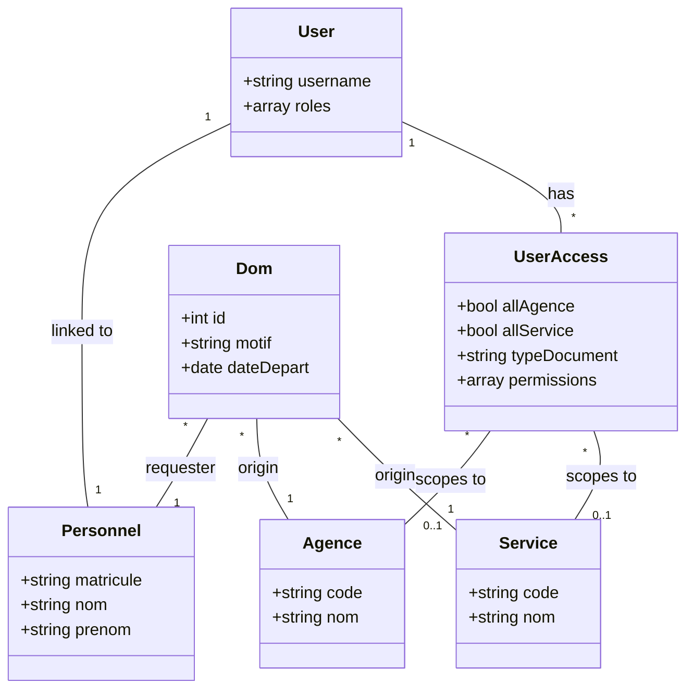

# 🗄️ Base de Données

L'application utilise une base de données relationnelle (SQLSERVER 2019) gérée par Doctrine ORM. Et une autre INFORMIX gérée par ODBC.

## 🔑 Concepts Clés

### Entités Principales

-   `User` : Compte utilisateur (login LDAP).
-   `Personnel` : Informations des Personnels (Matricule, Nom, Prénom). Lié à `User`.
-   `Agence` : Entité géographique (Tana, Tamatave...).
-   `Service` : Entité fonctionnelle (IT, RH, Compta...).
-   `Dom` (Demande d'Ordre de Mission) : Entité principale du module RH/Mission.

### UserAccess (Gestion des droits)

L'entité centrale pour la gestion des droits est `App\Entity\Admin\PersonnelUser\UserAccess`.
Elle permet de définir finement **QUI** a accès à **QUOI** (Agence/Service) pour **QUEL TYPE** de document, avec **QUELLES PERMISSIONS**.

#### Logique de filtrage

Les propriétés suivantes déterminent la portée de l'accès :

-   `allAgence` (bool) : Si `true`, l'utilisateur a accès à **Toutes les agences**.
-   `allService` (bool) : Si `true`, l'utilisateur a accès à **Tous les services**.
-   `agence` (Relation) : Si défini, limite l'accès à cette agence spécifique.
-   `service` (Relation) : Si défini, limite l'accès à ce service spécifique.
-   `typeDocument` (Relation) : Si défini, cet accès ne s'applique qu'à ce type de document (ex: "Ordre de Mission").

#### Combinaisons fréquentes

| AllAgence | AllService | Agence | Service | Résultat |
| :---: | :---: | :--- | :--- | :--- |
| ✅ | ✅ | - | - | **Super Admin** (Accès total) |
| ✅ | ❌ | - | - | **Directeur** (Accès à toutes les agences, mais services limités selon autre règle ou null) |
| ❌ | ❌ | Tana | Info | **Utilisateur Standard** (Accès uniquement au service Info de Tana) |
| ❌ | ✅ | Tana | - | **Chef d'Agence** (Accès à tous les services de Tana) |
## 📋 Listes de Référence

### Agences

-   `01` : ANTANANARIVO
-   `02` : CESSNA IVATO
-   `20` : FORT-DAUPHIN
-   `30` : AMBATOVY
-   `40` : TAMATAVE
-   ... (Voir `PROJECT_SUMMARY.md` pour la liste complète)

### Services

-   `INF` : INFORMATIQUE
-   `RH` : RESSOURCES HUMAINES
-   `FIN` : FINANCE
-   ...
