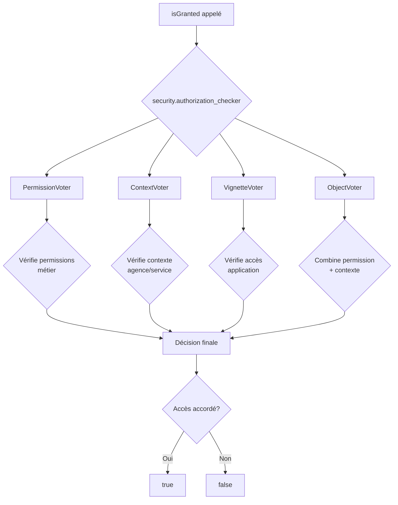
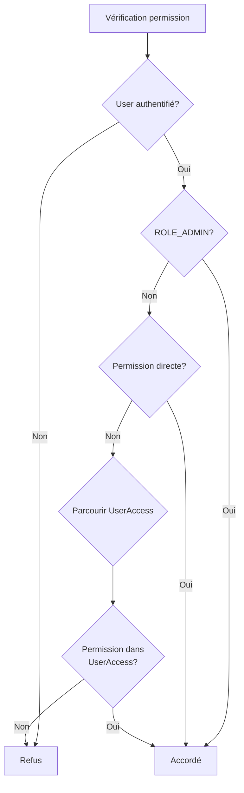
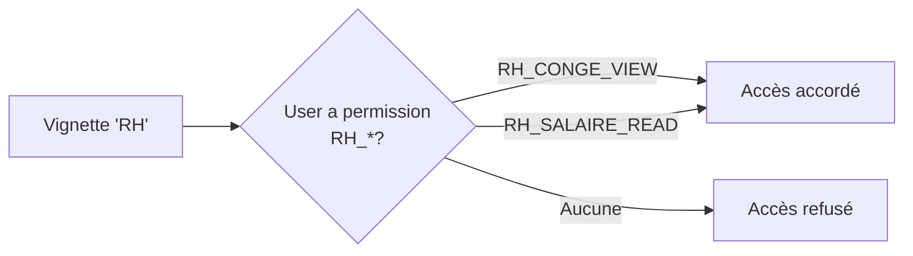
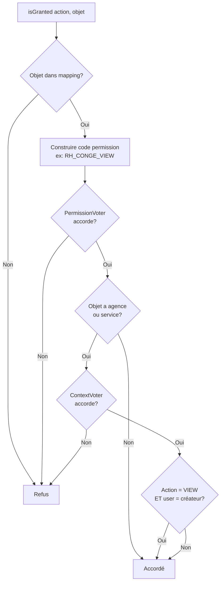

# Documentation des Voters

Cette documentation décrit les voters utilisés dans l'application pour gérer les permissions et le contrôle d'accès.

## Vue d'ensemble

Les voters sont un mécanisme de sécurité de Symfony qui permet de gérer des logiques de permissions complexes. Chaque voter est une classe qui implémente `Symfony\Component\Security\Core\Authorization\Voter\Voter` et qui est chargée de voter sur une permission (un "attribut") pour un objet donné (un "sujet").

Le service de sécurité de Symfony (`security.authorization_checker`) consulte les voters chaque fois que la méthode `isGranted()` est appelée.

### Architecture des Voters



### Les Voters de l'application

L'application utilise 4 voters complémentaires :

| Voter | Responsabilité | Attributs gérés | Documentation |
|-------|---------------|-----------------|---------------|
| **PermissionVoter** | Vérifie les permissions métier | Codes de permission (ex: `RH_CONGE_CREATE`) | [Voir détails](#permissionvoter) |
| **ContextVoter** | Vérifie le contexte organisationnel | `CONTEXT_ACCESS` | [Voir détails](ContextVoter.md) |
| **VignetteVoter** | Contrôle l'accès aux applications | `APPLICATION_ACCESS` | [Voir détails](VignetteVoter.md) |
| **ObjectVoter** | Sécurise les actions CRUD | `VIEW`, `EDIT`, `DELETE`, `VALIDATE`, `CREATE` | [Voir détails](#objectvoter) |

---

## PermissionVoter

**Fichier :** [PermissionVoter.php](../../src/Security/Voter/PermissionVoter.php)

### Rôle

Ce voter est le plus fondamental. Il vérifie si un utilisateur possède une **permission métier** donnée, représentée par un code (une chaîne de caractères).

Exemples de codes de permission : `RH_CONGE_CREATE`, `APPRO_BC_VALIDATE`, `ADMIN_USER_EDIT`.

### Utilisation

#### Dans un contrôleur

```php
use Symfony\Bundle\FrameworkBundle\Controller\AbstractController;

class CongeController extends AbstractController
{
    public function create()
    {
        // Vérifie si l'utilisateur peut créer une demande de congé
        if (!$this->isGranted('RH_CONGE_CREATE')) {
            throw $this->createAccessDeniedException();
        }
        
        // Ou avec denyAccessUnlessGranted
        $this->denyAccessUnlessGranted('RH_CONGE_CREATE');
        
        // L'utilisateur a la permission, continuer...
    }
}
```

#### Dans un template Twig

```twig

    <a href="{{ path('conge_create') }}" class="btn btn-primary">
        Nouvelle demande de congé
    </a>

```

#### Dans un service

```php
use Symfony\Component\Security\Core\Authorization\AuthorizationCheckerInterface;

class CongeService
{
    public function __construct(
        private AuthorizationCheckerInterface $authChecker
    ) {}
    
    public function canUserCreateConge(): bool
    {
        return $this->authChecker->isGranted('RH_CONGE_CREATE');
    }
}
```

### Logique de vérification



**Ordre de vérification :**

1. **Permissions directes :** Le voter vérifie d'abord si l'utilisateur a la permission directement associée à son profil via `User->getPermissionsDirectes()`
2. **Accès étendus (`UserAccess`) :** Il parcourt ensuite les "accès étendus" de l'utilisateur. Un `UserAccess` peut donner des permissions pour un périmètre fonctionnel (toutes les agences, une agence spécifique, etc.)
3. **Rôle `ROLE_ADMIN` :** Si l'utilisateur a le rôle `ROLE_ADMIN`, il a tous les droits

> [!IMPORTANT]
> Le `PermissionVoter` accepte **n'importe quelle chaîne de caractères** comme attribut. Il est donc utilisé comme voter de base pour toutes les vérifications de permissions métier.

---

## ContextVoter

**Fichier :** [ContextVoter.php](../../src/Security/Voter/ContextVoter.php)

### Rôle

Ce voter vérifie si un utilisateur a le droit d'accéder à une ressource en fonction de son **contexte organisationnel** (agence et service).

### Utilisation

Il est souvent utilisé en conjonction avec d'autres voters. Le sujet doit être un tableau contenant une instance d'`Agence` et une instance de `Service`.

#### Dans un contrôleur

```php
public function edit(DemandeConge $demandeConge)
{
    $agence = $demandeConge->getAgence();
    $service = $demandeConge->getService();
    
    // Vérifie que l'utilisateur a accès à ce périmètre
    $this->denyAccessUnlessGranted('CONTEXT_ACCESS', [$agence, $service]);
    
    // Continuer avec l'édition...
}
```

#### Dans un autre voter (ObjectVoter)

```php
// Vérification du contexte dans ObjectVoter
if ($agence || $service) {
    if (!$this->authChecker->isGranted('CONTEXT_ACCESS', [$agence, $service])) {
        return false;
    }
}
```

### Logique de vérification

Le voter analyse les `UserAccess` de l'utilisateur pour déterminer s'il a accès au contexte demandé :

| Cas | `allAgence` | `allService` | `agence` | `service` | Accès accordé si... |
|-----|-------------|--------------|----------|----------|---------------------|
| 1️⃣ Accès total | ✅ | ✅ | - | - | Toujours |
| 2️⃣ Toutes agences, service spécifique | ✅ | ❌ | - | ✅ | Service correspond |
| 3️⃣ Agence spécifique, tous services | ❌ | ✅ | ✅ | - | Agence correspond |
| 4️⃣ Agence et service spécifiques | ❌ | ❌ | ✅ | ✅ | Agence ET service correspondent |

> [!NOTE]
> Le rôle `ROLE_ADMIN` donne automatiquement accès à tous les contextes.

**Documentation complète :** [ContextVoter.md](ContextVoter.md)

---

## VignetteVoter

**Fichier :** [VignetteVoter.php](../../src/Security/Voter/VignetteVoter.php)

### Rôle

Ce voter détermine si un utilisateur a le droit de **voir ou d'accéder à une application** (représentée par une "vignette" sur la page d'accueil).

### Utilisation

Il est utilisé pour afficher dynamiquement les vignettes sur la page d'accueil en fonction des droits de l'utilisateur.

#### Dans un template Twig

```twig
{# Affichage conditionnel des vignettes #}

    
        <div class="vignette">
            <a href="{{ vignette.url }}">
                <i class="{{ vignette.icon }}"></i>
                {{ vignette.nom }}
            </a>
        </div>
    

```

### Logique de correspondance

Le voter vérifie si l'utilisateur possède **au moins une permission** dont le code commence par le nom de la vignette :

| Vignette | Permissions donnant accès | Exemples |
|----------|---------------------------|----------|
| **RH** | `RH_*` | `RH_CONGE_VIEW`, `RH_CONGE_CREATE`, `RH_SALAIRE_READ` |
| **APPRO** | `APPRO_*` | `APPRO_BC_VIEW`, `APPRO_BC_VALIDATE` |
| **ADMIN** | `ADMIN_*` | `ADMIN_USER_EDIT`, `ADMIN_PERMISSION_MANAGE` |



> [!TIP]
> Cette vérification est faite sur les permissions directes ET les permissions issues des `UserAccess`.

**Documentation complète :** [VignetteVoter.md](VignetteVoter.md)

---

## ObjectVoter

**Fichier :** [ObjectVoter.php](../../src/Security/Voter/ObjectVoter.php)

### Rôle

Ce voter est un **voter générique** pour les entités (objets métier). Il combine une vérification de permission métier et une vérification de contexte.

### Actions supportées

| Action | Description | Exemple de permission générée |
|--------|-------------|-------------------------------|
| `VIEW` | Consulter l'objet | `RH_CONGE_VIEW` |
| `EDIT` | Modifier l'objet | `RH_CONGE_EDIT` |
| `DELETE` | Supprimer l'objet | `RH_CONGE_DELETE` |
| `VALIDATE` | Valider l'objet | `RH_CONGE_VALIDATE` |
| `CREATE` | Créer un nouvel objet | `RH_CONGE_CREATE` |

### Utilisation

#### Dans un contrôleur

```php
use App\Entity\DemandeConge;

class CongeController extends AbstractController
{
    public function show(DemandeConge $demandeConge)
    {
        // Vérifie si l'utilisateur peut voir cette demande
        $this->denyAccessUnlessGranted('VIEW', $demandeConge);
        
        return $this->render('conge/show.html.twig', [
            'demande' => $demandeConge
        ]);
    }
    
    public function edit(DemandeConge $demandeConge)
    {
        // Vérifie si l'utilisateur peut modifier cette demande
        $this->denyAccessUnlessGranted('EDIT', $demandeConge);
        
        // Traiter le formulaire...
    }
    
    public function delete(DemandeConge $demandeConge)
    {
        // Vérifie si l'utilisateur peut supprimer cette demande
        $this->denyAccessUnlessGranted('DELETE', $demandeConge);
        
        // Supprimer...
    }
}
```

#### Dans un template Twig

```twig
{# Affichage conditionnel des boutons d'action #}
<div class="actions">
    
        <a href="{{ path('conge_edit', {id: demande.id}) }}" class="btn btn-primary">
            Modifier
        </a>
    
    
    
        <a href="{{ path('conge_delete', {id: demande.id}) }}" class="btn btn-danger">
            Supprimer
        </a>
    
    
    
        <a href="{{ path('conge_validate', {id: demande.id}) }}" class="btn btn-success">
            Valider
        </a>
    
</div>
```

### Logique de vérification



**Étapes de vérification :**

1. **Mapping Entité → Préfixe de permission :** Le voter utilise un mapping pour déterminer le préfixe de permission associé à une classe d'entité
   - Exemple : `DemandeConge::class => 'RH_CONGE_'`
   
2. **Vérification de la permission métier :** Il vérifie si l'utilisateur a la permission requise en combinant le préfixe et l'action
   - Exemple : pour `isGranted('VIEW', $demandeConge)`, il vérifie la permission `RH_CONGE_VIEW` (via le `PermissionVoter`)
   
3. **Vérification du contexte :** Si l'entité est liée à une agence ou un service, il vérifie que l'utilisateur a bien accès à ce contexte (via le `ContextVoter`)

4. **Cas particulier `VIEW` :** Si l'action est `VIEW` et que l'utilisateur est le créateur de l'objet, il est toujours autorisé à le voir

> [!WARNING]
> Le mapping des entités doit être configuré dans le voter. Si une entité n'est pas dans le mapping, l'accès sera **toujours refusé**.

### Configuration du mapping

Pour ajouter une nouvelle entité au `ObjectVoter`, modifiez le tableau `$map` dans la méthode `voteOnAttribute` :

```php
// Dans ObjectVoter.php
protected function voteOnAttribute(string $attribute, $subject, TokenInterface $token): bool
{
    // ...
    
    $map = [
        DemandeConge::class => 'RH_CONGE_',
        BonCommande::class => 'APPRO_BC_',
        // Ajouter vos entités ici
    ];
    
    // ...
}
```

---

## Bonnes pratiques

### 1. Utiliser le bon voter pour le bon cas

| Besoin | Voter à utiliser | Exemple |
|--------|------------------|---------|
| Vérifier une permission métier simple | `PermissionVoter` | `isGranted('RH_CONGE_CREATE')` |
| Vérifier l'accès à un contexte | `ContextVoter` | `isGranted('CONTEXT_ACCESS', [$agence, $service])` |
| Vérifier l'accès à une application | `VignetteVoter` | `isGranted('APPLICATION_ACCESS', $vignette)` |
| Vérifier une action sur une entité | `ObjectVoter` | `isGranted('EDIT', $demandeConge)` |

### 2. Combiner les voters

Les voters peuvent être combinés pour des vérifications complexes :

```php
// Vérifier la permission ET le contexte manuellement
if ($this->isGranted('RH_CONGE_VALIDATE') && 
    $this->isGranted('CONTEXT_ACCESS', [$demande->getAgence(), $demande->getService()])) {
    // L'utilisateur peut valider cette demande
}

// Ou utiliser ObjectVoter qui fait les deux automatiquement
if ($this->isGranted('VALIDATE', $demande)) {
    // Même résultat, plus simple
}
```

### 3. Sécuriser à plusieurs niveaux

> [!IMPORTANT]
> Appliquez le principe de défense en profondeur : sécurisez à la fois dans les contrôleurs ET dans les templates.

```php
// Dans le contrôleur
public function edit(DemandeConge $demande)
{
    $this->denyAccessUnlessGranted('EDIT', $demande);
    // ...
}
```

```twig
{# Dans le template #}

    <a href="{{ path('conge_edit', {id: demande.id}) }}">Modifier</a>

```

### 4. Gérer les cas d'erreur

```php
use Symfony\Component\Security\Core\Exception\AccessDeniedException;

public function sensitiveAction()
{
    try {
        $this->denyAccessUnlessGranted('SENSITIVE_PERMISSION');
        // Action sensible...
    } catch (AccessDeniedException $e) {
        // Logger l'accès refusé
        $this->logger->warning('Accès refusé', [
            'user' => $this->getUser()->getEmail(),
            'permission' => 'SENSITIVE_PERMISSION'
        ]);
        
        throw $e; // Relancer l'exception
    }
}
```

### 5. Tester les voters

Créez des tests unitaires pour vos voters :

```php
use App\Security\Voter\PermissionVoter;
use PHPUnit\Framework\TestCase;

class PermissionVoterTest extends TestCase
{
    public function testUserWithPermissionIsGranted()
    {
        $voter = new PermissionVoter();
        $user = $this->createUserWithPermission('RH_CONGE_CREATE');
        
        $this->assertTrue(
            $voter->vote($this->createToken($user), null, ['RH_CONGE_CREATE'])
        );
    }
}
```

**Voir aussi :** [VoterExamples.md](VoterExamples.md) pour des exemples de tests complets.

---

## Débogage

### Afficher les permissions d'un utilisateur

```php
// Dans un contrôleur ou service
$permissions = [];

// Permissions directes
foreach ($user->getPermissionsDirectes() as $permission) {
    $permissions[] = $permission->getCode();
}

// Permissions via UserAccess
foreach ($user->getUserAccesses() as $access) {
    foreach ($access->getPermissions() as $permission) {
        $permissions[] = $permission->getCode();
    }
}

dump($permissions);
```

### Déboguer une décision de voter

Utilisez le profiler Symfony en mode développement pour voir quels voters ont été consultés et leurs décisions.

```bash
# Activer le mode debug
APP_ENV=dev
```

Dans le profiler web, section "Security", vous verrez :
- Les voters consultés
- Leurs décisions (ACCESS_GRANTED, ACCESS_DENIED, ACCESS_ABSTAIN)
- Les attributs et sujets vérifiés

---

## Ressources supplémentaires

- [Documentation officielle Symfony sur les Voters](https://symfony.com/doc/current/security/voters.html)
- [ContextVoter - Documentation détaillée](ContextVoter.md)
- [VignetteVoter - Documentation détaillée](VignetteVoter.md)
- [VoterExamples - Exemples et tests](VoterExamples.md)
